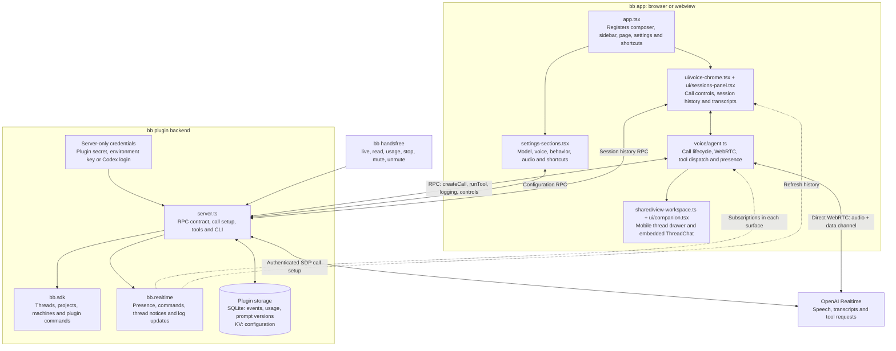
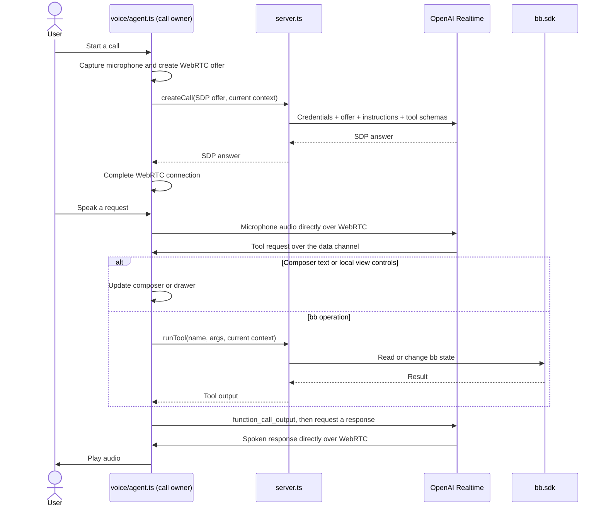
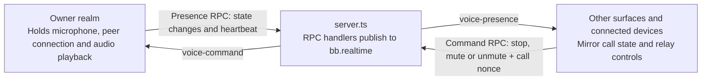

# Handsfree codebase diagram

Handsfree adds voice control to bb. The browser handles the microphone and the
OpenAI Realtime connection, while the plugin server holds credentials and runs
bb commands.

## Main components

The browser box groups frontend responsibilities, not a shared JavaScript
instance. Each bb surface has its own isolated JavaScript context, called a
realm, and its own `voiceAgent` instance.

## One spoken request

On mobile, opening a thread in the drawer first uses `resolveThreadViews` to
fetch its details. The drawer then displays the thread without navigating away
from the call. Desktop thread focus uses server-side navigation.

## One call across surfaces and devices

Only the owner holds the audio connection. Other surfaces cannot take over its
microphone. A new call ends the previous call through a `voice-call` broadcast.
The bus connects clients of one bb backend, not independent bb installations.

## Supporting files

| Files | Responsibility |
| --- | --- |
| `voice/tool-runner.ts` | Frontend tool dispatch: local tools, mobile drawer, RPC fallthrough. Owns the `Bindings` type. |
| `voice/presence.ts` | `PresenceChannel`: cross-surface mirror, heartbeat, expiry, command relay. |
| `voice/rtc-session.ts` | `SessionHandle`, ICE wait, `MicManager` (acquisition + suspend/recover). |
| `server/tools.ts` | Backend tool registry: each tool's schema + handler in one `ToolDef`. |
| `server/config.ts`, `server/credentials.ts` | kv-backed voice config and migration; API key / env / Codex subscription resolution. |
| `server/store.ts`, `server/cli.ts` | SQLite schema and queries (usage, transcripts, prompts); the `bb handsfree` CLI. |
| `server/realtime-call.ts`, `server/live-threads.ts`, `server/notifications.ts` | SDP exchange with OpenAI; the Live threads view; thread finish/fail announcements. |
| `shared/audio-devices.ts`, `shared/client-identity.ts` | Resolve microphone preferences and identify devices and realms. |
| `shared/models.ts`, `shared/shortcuts.ts`, `shared/shortcut-store.ts` | Define model and voice choices, validate shortcuts, and sync bindings. |
| `shared/session-events.ts`, `shared/thread-errors.ts` | Pair tool calls with results, classify outcomes, and format thread errors. |
| `components/ui/`, `hooks/`, `app.css` | Provide UI controls, drawer sizing, modal behavior, and styling. |

`voice/agent.ts` orchestrates the frontend modules; `server.ts` is the RPC
contract plus a composition root that wires the `server/` modules. Tests live
in `tests/`. Start reading with `app.tsx`, then `voice/agent.ts`, then
`server.ts`.
See [architecture and terminology](handsfree-voice-architecture.md) for ownership
and mobile lifecycle constraints.
